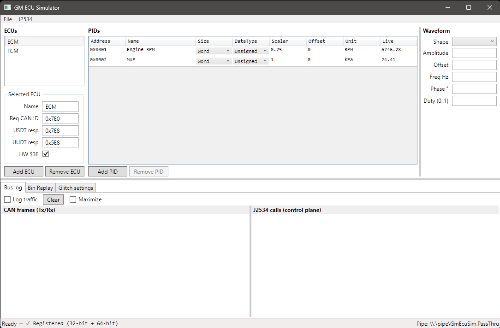
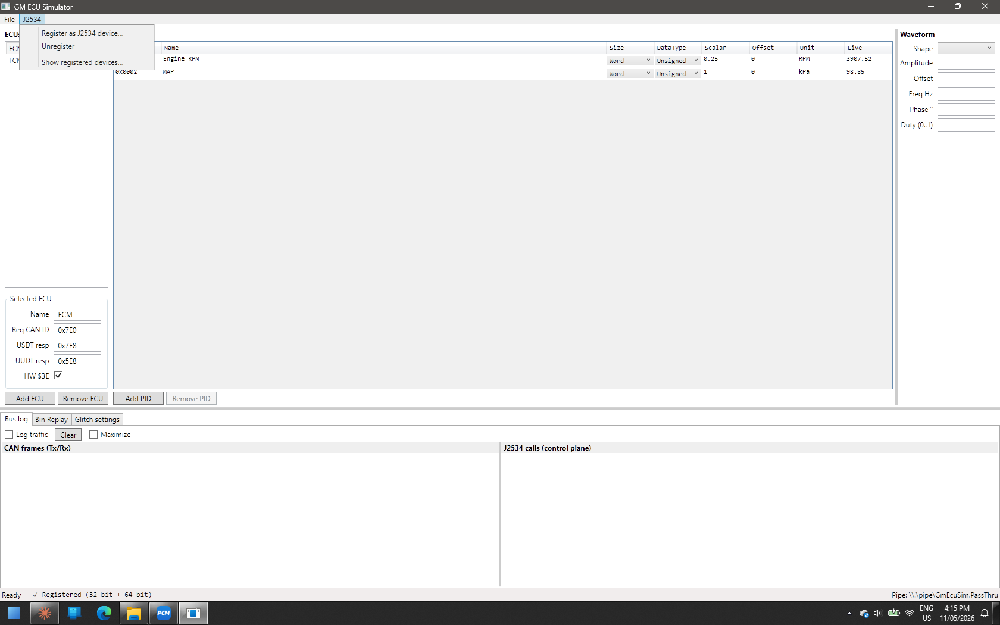
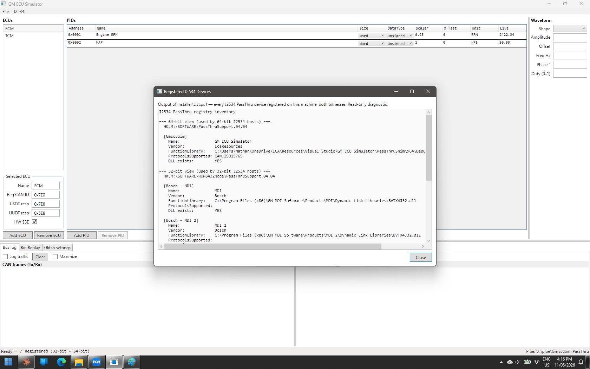
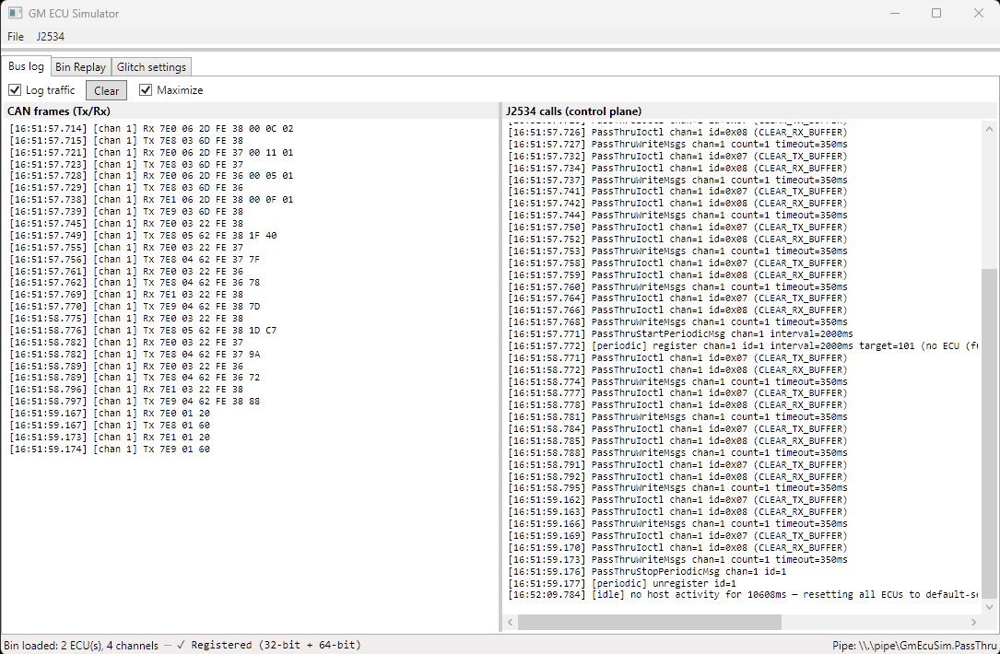
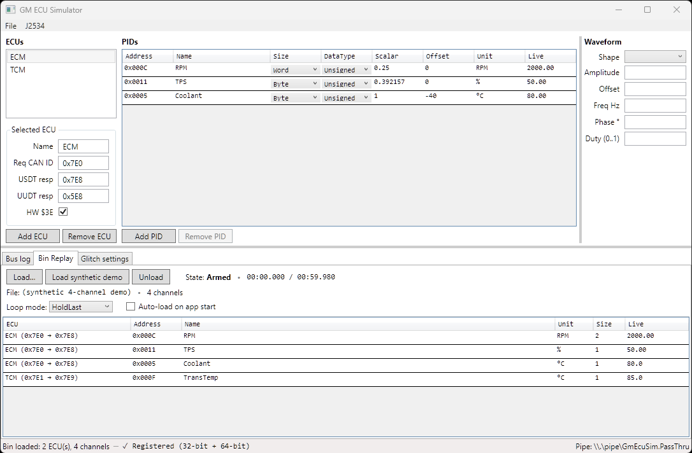

# GM ECU Simulator

A standalone Windows app that emulates one or more GM (GMLAN / GMW3110-2010) ECUs and **registers itself as a real J2534 PassThru device**. Any J2534-aware host - Tech 2 Win, GDS, MDI, your own logger - loads it via the standard registry path and connects to it as if it were a Tactrix OpenPort or MongoosePro.

> **Disclaimer:** This codebase was written 100% by AI (Claude Code). It builds, runs, and registers correctly against real J2534 hosts, but every line of source - protocol handlers, IPC layer, native shim, UI - was produced by a model. Treat it accordingly: read the code before you trust it with anything important.



## CAN-only - read this first

The **PassThruShim is deliberately a thin frame-forwarder**. It does not implement the J2534 ISO15765 (6) protocol layer that, on real hardware, would do ISO-TP framing on the host's behalf. The simulator behind the shim models a real ECU: it speaks raw CAN and runs its own ISO-TP reassembly, exactly as a real ECU does on the vehicle bus.

In other words, the role mapping is: PassThruShim plays the **J2534 device** (Tactrix / Mongoose firmware in the real world), and the simulator plays the **ECU** sitting on the far side of the bus. ISO15765 is a J2534-device concern, not an ECU concern, so the gap lives in the shim, not in the simulator.

A host that calls `PassThruConnect` with `ProtocolID.ISO15765` is therefore refused end-to-end: the request is forwarded through the shim, the simulator returns `ERR_INVALID_PROTOCOL_ID`, the J2534 calls log records the rejection, and the status bar names the rejected protocol so a third-party user can see why their connect failed.

Point your tester at `Protocol.CAN` and frame each USDT message yourself: PCI byte first (single-frame / first-frame / consecutive-frame / flow-control), then the diagnostic payload. The simulator handles the ECU-side half of ISO-TP; the host plays the role the shim isn't playing.

On real GM hardware ISO15765 is the more common choice because the J2534 driver hides ISO-TP from the tester. Here, with a passthrough shim, the host has to frame it itself. A future shim enhancement could add ISO15765 support transparently, without any changes to the simulator.

## What it does

* Implements GMW3110 services `$22` (ReadDataByPid), `$2C` (DynamicallyDefineMessage), `$2D` (DefinePidByAddress), `$AA` (ReadDataByPacketIdentifier - periodic UUDT push at Slow / Medium / Fast bands), `$27` (SecurityAccess - modular, see below), plus the auxiliary modes `$3E` TesterPresent, `$20` ReturnToNormal, and `$10` InitiateDiagnosticOperation needed for a real tester to handshake.
* Real ISO-TP segmentation/reassembly, flow-control frames, P3C timeout handling, idle-bus detection.
* N concurrent virtual ECUs on a virtual CAN bus, routed by destination CAN ID.
* PID values synthesised from waveforms (sine / triangle / square / sawtooth / constant) or replayed from `.bin` log files.
* Defaults to the OBD-II convention (`$7E0` request, `$7E8` USDT response, `$5E8` UUDT response). Per-ECU IDs are editable.

## Security (\$27)

`$27` is implemented behind a two-layer plug-in interface so different GM seed-key flavours can be slotted in per-ECU without touching the dispatcher:

* **`ISecurityAccessModule`** - owns a whole `$27` exchange step. The bundled `Gmw3110_2010_Generic` module covers the GMW3110-2010 protocol envelope (length validation, subfunction parity, pending-seed tracking, 3-strike lockout with 10s deadline-timestamp recovery, NRC `$12` / `$22` / `$35` / `$36` / `$37` paths).
* **`ISeedKeyAlgorithm`** - the small strategy you usually write. \~30 lines. `Gmw3110_2010_Generic` wraps one and handles everything else.

Ships with two algorithms registered out of the box, selectable per-ECU in the **Security \$27** tab:

* `gmw3110-2010-not-implemented` - deterministic seed `[0x12, 0x34]`, refuses every key. Exercises every NRC path against any J2534 host without committing real algorithm math.
* `gm-e38-test` - the GM E38 ECM algorithm (GMLAN algo `0x92`, also used by E67). 2-byte seed, 2-byte key. Optional `fixedSeed` JSON config for deterministic exchanges.

Each ECU's chosen module ID + module config blob persist to `ecu_config.json` (schema v3; v1/v2 configs load unchanged with no module → `$27` returns NRC `$11`).

See [`docs/security-access-modules.md`](docs/security-access-modules.md) for a step-by-step walkthrough of writing a new algorithm, using the E38 algorithm as the worked example.

## Architecture (one paragraph)

A J2534 host expects a native DLL with the 14 C exports defined by SAE J2534-1 v04.04. C# can't be loaded that way, so [`PassThruShim/`](PassThruShim/) is a thin native C++ DLL (built **32-bit and 64-bit**) whose only job is to forward each PassThru call as a length-prefixed binary frame over a Windows named pipe (`\\.\pipe\GmEcuSim.PassThru`). The C# WPF app in [`GmEcuSimulator/`](GmEcuSimulator/) hosts the pipe server, dispatches frames through a `RequestDispatcher` to a `VirtualBus`, which routes by CAN ID to one of N `EcuNode` instances. Each ECU runs ISO-TP reassembly, dispatches to a service handler, and enqueues responses back onto the channel's RX queue. [`Core/`](Core/) is the simulator engine; [`Common/`](Common/) is pure types and protocol constants.

## Conformance

**J2534-1 v04.04 only.** The shim exports exactly the 14 functions defined by v04.04 and reports `04.04` from `PassThruReadVersion`. The v05.00 additions (`ScanForDevices`, `GetNextDevice`, `LogicalConnect`, …) and the Drew Tech proprietary `PassThruGetNextCarDAQ` are **deliberately not exported**. From a J2534-Sharp host, call `api.GetDevice("")` for the default device - `api.GetDeviceList()` returns empty because that path is v05.00-only.

## Build

```PowerShell
# .NET projects (Common, Core, GmEcuSimulator)
dotnet build "GM ECU Simulator.sln" -c Debug

# Native shim - both bitnesses (J2534 hosts can be either)
$msbuild = "C:\Program Files\Microsoft Visual Studio\2022\Community\MSBuild\Current\Bin\MSBuild.exe"
& $msbuild "PassThruShim\PassThruShim.vcxproj" /p:Configuration=Debug /p:Platform=x64
& $msbuild "PassThruShim\PassThruShim.vcxproj" /p:Configuration=Debug /p:Platform=Win32

# Or do all three in one shot (requires elevation):
.\Installer\Register.ps1 -Build
```

Outputs:

* `PassThruShim\x64\Debug\PassThruShim64.dll`
* `PassThruShim\Debug\PassThruShim32.dll`
* `GmEcuSimulator\bin\Debug\net9.0-windows\GmEcuSimulator.exe`

## Register as a J2534 device

Either click **J2534 → Register as J2534 device…** in the app's menu bar (UAC prompts; the underlying script runs elevated and exits) or run `.\Installer\Register.ps1` from an elevated PowerShell directly. Both write the same standard v04.04 registry entries (`HKLM\SOFTWARE\PassThruSupport.04.04\GmEcuSim` and the `WOW6432Node` mirror, flat layout - all values directly on the `GmEcuSim` subkey).



**Both bitnesses are required.** A Windows process can only `LoadLibrary` a DLL of its own bitness - 64-bit hosts load `PassThruShim64.dll`, 32-bit hosts load `PassThruShim32.dll`, never mixed. `Register.ps1` writes both registry views, each pointing at the matching shim. The status bar in the app reflects the current state ("✓ Registered (32-bit + 64-bit)" / "Not registered") after every Register/Unregister click.

**Diagnostic dialog:** **J2534 → Show registered devices…** runs `Installer\List.ps1` (read-only, no elevation) and shows every J2534 device on the machine across both registry views, with DLL existence checks. Useful for verifying what changed and for triaging "device doesn't show in host" reports.



## Use

1. Run `GmEcuSimulator.exe`. The named-pipe server starts listening.
2. Define ECUs and PIDs in the editor. Each PID gets a waveform (or pulls from a `.bin` replay), a scalar/offset, a unit string, and a size (Byte / Word / DWord). The **Live** column shows the current synthesised value.
3. Launch your J2534 host. "GM ECU Simulator" appears in its device dropdown. The shim is `LoadLibrary`'d into the host process and forwards every PassThru call to the simulator.
4. The **Bus log** tab shows live CAN frames (Tx/Rx) on the left and J2534 control-plane calls (Open/Connect/Filter/ReadMsgs/…) on the right.



## Bin Replay

Load a `.bin` data-logger capture file (or the built-in 4-channel synthetic demo) and the simulator will replay the recorded values through your defined PIDs. ECUs and channels are auto-mapped by node type and PID address.



## Documentation

A full user manual lives at [`docs/GM_ECU_Simulator_User_Manual.pdf`](docs/GM_ECU_Simulator_User_Manual.pdf).

## Status / scope

* v04.04 conformance only - by design.
* Glitch injection (per-service NRC / drop / corrupt-byte / random) has UI and config plumbing but is not yet consulted by the dispatcher at runtime.
* This was built primarily as a development aid for a sibling data-logger project. It's not a certified tool and not affiliated with GM.

