# E38 DPS flow - 2011 Silverado (VIN 1GCRKSE36BZ158034)

Archive: `C:\DpsArch\E38_1GCRKSE36BZ158034.zip`
Utility file: `12645553.bin` (17,328 bytes, no PTI wrapper, 121 interpreter steps)
ECM: E38 LY6, OS PN `12639835`, 8 calibration files

What this is: a step-by-step walkthrough of the interpreter bytecode that DPS executes against the ECM for this specific archive. Goto-semantics per `reference_dps_utility_file_format.md` (pos-SID echo, NRC, `0xFF` catch-all, `0xFD` no-response).

---

## Flow diagram

```mermaid
flowchart TD
    Start([DPS press Program])

    subgraph P0["Phase 0 - Init and authenticate"]
        S1["step 1: $01 SETUP_GLOBAL_VARIABLES<br/>target diag addr 0x11"]
        S2["step 2: $27 SecurityAccess sub-0x92<br/>(gm-e38-test seed/key)"]
    end

    subgraph P1["Phase 1 - Kernel into RAM"]
        S3["step 3: $34 RequestDownload<br/>kernel chunk 1"]
        S4["step 4: $B0 BlockTransferToRAM<br/>routine[0] 5440 bytes @ 0x003FC430"]
        S5["step 5: $34 RequestDownload<br/>kernel chunk 2"]
        S6["step 6: $B0 BlockTransferToRAM<br/>routine[1] 740 bytes @ 0x003FC430"]
        S7["step 7: $1A C1 ReadDataByIdentifier<br/>(poll kernel-ready DID)"]
        S8{"step 8: $53 CompareData<br/>kernel ready?"}
        S9_10["steps 9-10: counter + 1s delay<br/>(retry-loop back to step 7)"]
    end

    subgraph P2["Phase 2 - Calibration flash"]
        direction TB
        S11["step 11: $F3 SetGlobalHeaderLength = 8"]
        S12_13["steps 12-13: $34 + $B0<br/>cal block 1"]
        S14["step 14: $F3 SetGlobalHeaderLength = 0"]
        S15_24["steps 15-24: 5x ($34 + $B0)<br/>cal blocks 2-6"]
        S25["step 25: $34 RequestDownload"]
        S26_29["steps 26-29: poll $1A C9 + compare + retry"]
        S30_33["steps 30-33: poll $1A CA + compare + retry"]
        S34_43["steps 34-43: more $F3 + $34 + $B0<br/>(header 0x80 then 0x00; cal blocks 7-8)"]
        S44(["step 44: $FF END_WITH_SUCCESS"])
    end

    subgraph ERR["Error tail"]
        S45_46["steps 45-46: $FB counter + $FC 1s delay<br/>(retry path - loops back to step 2)"]
        S47([step 47: $EE END_WITH_ERROR])
    end

    subgraph P3["Phase 3 - Post-flash configuration (alternate entry)"]
        direction TB
        S48["step 48: $56 INTERPRETER_IDENTIFIER<br/>(secondary entry point selector)"]
        S49["step 49: $27 SecurityAccess sub-0x0F<br/>(production/config unlock)"]
        S50["step 50: $22 ReadDataByParameterId<br/>PID 0x155B sub 03 (boot/cal info)"]
        S51_59["steps 51-59: $54 CHANGE_DATA cascade<br/>(build control bytes 03/04/05/06/0D)"]
        S60_78["steps 60-78: $53 + $1A 90/A0 + $54<br/>(cross-check DIDs, write working set)"]
        S79_89["steps 79-89: $1A A0/90, INTERPRETER_IDENTIFIER branch,<br/>$22 PID 20-49, $54 + $53"]
        S90_91["steps 90-91: $1A DF + $01 SETUP_GLOBAL<br/>(addr context switch)"]
        S92["step 92: $3B WriteDataByIdentifier DID $DF<br/>(traceability)"]
        S93["step 93: $54 CHANGE_DATA"]
        S94_96["steps 94-96: $3B WRITE $98 / $99 / $90<br/>(VIN block)"]
        S97["step 97: $AE RequestDeviceControl 0x28 03<br/>(close programming)"]
    end

    subgraph TAIL["Retry helpers (steps 98-121)"]
        TailNote["Repeating ($FB counter + $FC delay) pairs<br/>branching back into Phase 3 nodes<br/>(steps 98-121, 12 retry helpers)"]
    end

    Start --> S1 --> S2
    S2 -- "$67 pos" --> S3
    S2 -- "NRC $37" --> S45_46
    S2 -- "other / FF" --> S47

    S3 -- "$74 pos" --> S4 -- "$76 pos" --> S5
    S5 -- "$74 pos" --> S6 -- "$76 pos" --> S7
    S7 -- "$5A pos" --> S8
    S7 -- "NRC $31" --> S11
    S7 -- "other / FF" --> S9_10 --> S7
    S8 -- "match" --> S11
    S8 -- "mismatch" --> S9_10

    S11 --> S12_13 --> S14 --> S15_24 --> S25
    S25 --> S26_29 --> S30_33 --> S34_43 --> S44

    S44 -.->|host then runs<br/>secondary interpreter| S48
    S48 --> S49 -- "$67 pos" --> S50
    S50 --> S51_59 --> S60_78 --> S79_89 --> S90_91
    S90_91 --> S92 --> S93 --> S94_96 --> S97

    S97 -- "fail" --> S47
    S97 -- "complete" --> Done([Programming Successfully Ended])

    TAIL -. "various NRC paths" .-> P3

    classDef phase fill:#1a3a5c,stroke:#5a8fbf,color:#e8eef5;
    classDef err fill:#5c1a1a,stroke:#bf5a5a,color:#f5e8e8;
    classDef done fill:#1a5c2e,stroke:#5abf6f,color:#e8f5ec;
    class P0,P1,P2,P3,TAIL phase;
    class ERR err;
    class Done done;
```



---

## Phase-by-phase notes

### Phase 0 - Init and authenticate (steps 1-2)

| Step | Op   | Action            | Notes |
|-----:|------|-------------------|-------|
| 1    | $01  | `11 F1 00 00`     | Target diag addr `0x11` (SPS_Type_C entry point in our sim config). |
| 2    | $27  | `92 00 00 00`     | Security algo $92 = E38 production. Simulator uses `gm-e38-test`; bypass path is `gmw3110-programming-bypass`. |

NRC `$37` (timeDelayNotExpired) routes through retry pair 45-46 back to step 2. Any other failure goes to `END_WITH_ERROR` (step 47). Standard pattern.

### Phase 1 - Kernel into RAM (steps 3-10)

Two `$34`+`$B0` pairs bring the kernel into RAM at `0x003FC430`:
- Routine[0] = 5440 bytes (the kernel proper).
- Routine[1] = 740 bytes (kernel data tables).

Then a poll loop (`$1A C1` + `$53 COMPARE` + counter/delay) waits for the kernel to come up. NRC `$31` from the read is treated as "not ready, try next step" rather than fatal - the loop continues until either the compare matches or the retry counter exhausts.

### Phase 2 - Calibration flash (steps 11-44)

The interpreter sets header-length context twice (`$F3` op): `0x08` before the first cal block, `0x00` for the remainder. This is the standard GMW3110 header switch for going from extended (CAN-ID + sub-address) to standard frames once the kernel is running.

The flash itself is `$34`/`$B0` pairs for 8 calibration files matching the `.tbl` manifest:

| Slot | Cal PN     | Bytes  | Routine target          |
|-----:|------------|-------:|-------------------------|
| 1    | 12639835   | 1,771,520 | OS module |
| 2    | 12637641   | 38,620 |  |
| 3    | 12636563   | 8,896  |  |
| 4    | 12620806   | 816    |  |
| 5    | 12656714   | 5,120  |  |
| 6    | 12656698   | 208,692 |  |
| 7    | 12625892   | 26,752 |  |
| 8    | 12620683   | 1,536  |  |

Status-polling sub-block (steps 26-33) reads `$1A C9` then `$1A CA` between cal pieces, presumably progress / state confirmations from the kernel. Both feed retry counters with 1s delays.

Step 44 (`$FF END_WITH_SUCCESS`) is the happy-path terminator for the flash phase. The secondary interpreter section (Phase 3) is reached only after the host starts the next interpreter pass.

### Phase 3 - Post-flash configuration (steps 48-97)

This is the part that is currently painful when faking the ECM. Step 48's `$56 INTERPRETER_IDENTIFIER` is the alternate entry-point selector - DPS picks this section after the flash completes.

Sequence:
1. **Production unlock** (step 49): `$27` sub `0x0F`. Different access level than Phase 0 - this is the "now-let-me-configure-you" key.
2. **Read configuration anchor** (step 50): `$22` PID `0x155B` sub 03. This is the 17-byte boot/cal-info PID called out in `reference_e38_pid_extraction.md` - it returns the cal state DPS needs to drive every following decision.
3. **Build a control-byte working set** ($54 CHANGE_DATA cascade, steps 51-59): bytes 03/04/05/06/0D get masks applied. These are kept in interpreter-local variables, not written to the ECU yet.
4. **Cross-check DIDs and conditionally branch** (steps 60-89): a long chain of `$1A` reads (DIDs `$90`, `$A0`, `$DF`), `$53` compares, and more `$54` updates. This is the part with the most branching - the steps 98-121 retry-helpers feed back into here for each conditional that can NRC out.
5. **Persist VIN / traceability** ($3B writes, steps 92-96): `$DF`, `$98`, `$99`, `$90`. These are the four traceability DIDs DPS expects to commit at end-of-programming.
6. **Close programming** (step 97): `$AE RequestDeviceControl 0x28 03`. CPID `$28` = "end of programming event"; the `0x03` arg is the close-with-commit variant.

The retry tail (steps 98-121) is twelve `$FB counter + $FC delay` pairs, each looping back into Phase 3 nodes. These exist because almost every $1A read and $53 compare in Phase 3 has a "wait and re-poll" branch for the ECM-busy NRC case.

---

## What this tells us about emulation scope

Phases 0-2 are already validated end-to-end (per `project_dps_e2e_validated.md`). They only need protocol-correct responses, not firmware semantics - the simulator passes the seed/key, accepts the downloads, and replies with the spec-defined echoes.

Phase 3 is where the simulator currently leans on `StaticBytes` PID dumps. The interesting structure here is:

- **PID 0x155B** is the keystone. Every Phase 3 decision flows from its 17 bytes. A correctly-shaped static value covers most paths.
- **DIDs $90, $A0, $DF, $98, $99** are *both* read and written within Phase 3. The handler has to remember $3B writes within the session and replay them on subsequent $22 / $1A reads. This is the write-then-read-back state-machine work mentioned in the previous turn.
- **No $53 COMPARE_DATA against computed values** appears in Phase 3 - every compare is against a literal byte. That is good news: we do not need CVN-style checksum computation to satisfy DPS post-flash, only consistent identifier responses.
- **$AE 0x28 03** must return a positive echo and not error. The simulator already handles this (validated 2026-05-16).

So the "emulate the firmware" framing for DPS post-flash collapses to two concrete things: (a) ship a known-good 17-byte `0x155B` value plus the surrounding DIDs as `StaticBytes`, and (b) make the $3B write handler persist into the same DID's read response for the rest of the session. No PowerPC needed.

---

## Re-deriving this for a different archive

```powershell
cd "C:\Users\Nathan\OneDrive\ECA\Resources\Visual Studio\GM ECU Simulator"
$py = "C:\Users\Nathan\AppData\Local\Programs\Python\Python313\python.exe"
$tmp = "$env:TEMP\dps_extract"
Remove-Item $tmp -Recurse -Force -ErrorAction SilentlyContinue
Expand-Archive C:\DpsArch\<archive>.zip -DestinationPath $tmp
& $py tools\dps_utility_builder\parse_utility_file.py "$tmp\<utility_file>.bin"
```

The utility file is whichever `.bin` is labelled `Utility File` (not `Description of Cal`) in the `.tbl` manifest. The parse output gives step-by-step interpreter instructions; group by op-code and graph the gotos to get a flow diagram for that specific archive.
